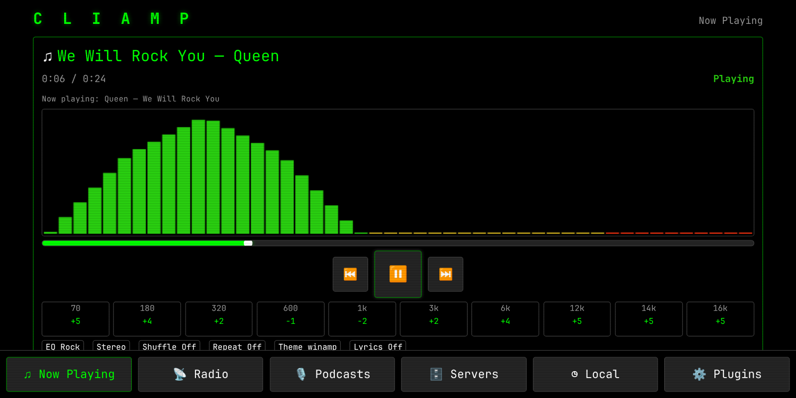
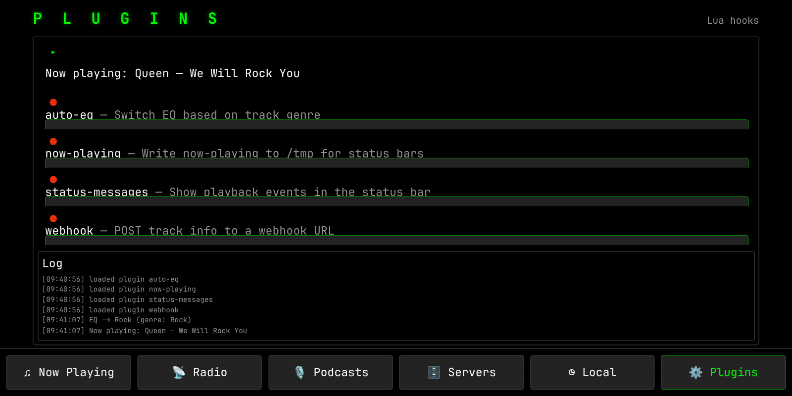
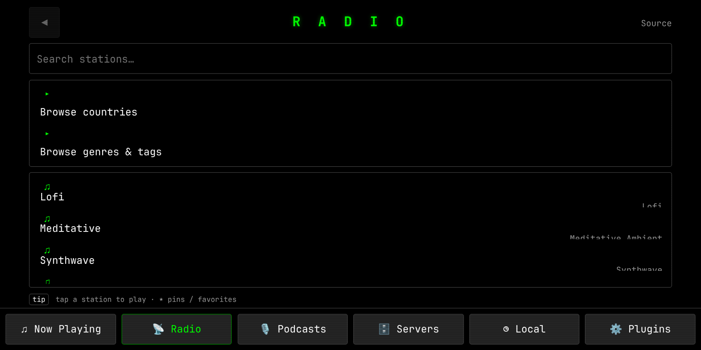
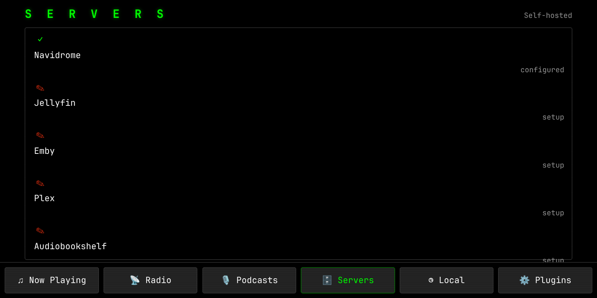

# cliamp-web

**A retro terminal music player, 100% web-native.** Built to be driven by touch
from a car's in-car browser — landscape-first, big targets, no keyboard, no
backend.

A complete port of [cliamp](https://github.com/keylimesoda/cliamp) (the Go +
Bubbletea terminal player) to a static PWA: React + TypeScript + Vite +
zustand, with a real-time Web Audio engine (spectral visualizer, 10-band EQ,
pitch/time-stretch, gapless-style transitions) and a **Lua plugin system**
running in the browser.

**Live: [keylimesoda.github.io/cliamp-web](https://keylimesoda.github.io/cliamp-web/)**



| | |
| --- | --- |
|  |  |
| Lua plugins with live log | Internet radio (Radio Browser) |
|  | |
| Self-hosted music servers | |

## Features

- **Now Playing** — touch transport (prev / play-pause / next), seek bar,
  10-band EQ with presets, pitch/time-stretch, mono, shuffle/repeat,
  real-time spectrum visualizer, volume.
- **Music sources**
  - **Radio** — Radio Browser (countries, genres/tags) + built-in preset stations.
  - **Podcasts** — Apple top charts, search, RSS enclosures.
  - **Self-hosted** — Navidrome (Subsonic), Jellyfin, Emby, Plex,
    Audiobookshelf, Lyrion (LMS), with in-app server setup and browse UIs.
- **History & favorites** — recent plays (deduped) and a favorites list,
  persisted locally.
- **Lyrics** — LRC sidecars + LRCLIB lookup, synced to playback.
- **Lua plugins** — a Lua 5.1-style interpreter in TypeScript; plugins hook
  `track.change`, `playback.state`, `track.scrobble`, `app.start`, control
  playback, read tracks, and surface status messages. Four bundled:
  `auto-eq` (genre→EQ preset), `now-playing` (status file), `status-messages`,
  `webhook`. See [docs/lua-plugins.md](docs/lua-plugins.md).
- **Themes** — 22 vendored cliamp themes as runtime CSS variables.
- **PWA** — installable, service-worker app-shell caching, fullscreen
  landscape manifest.

## Quickstart

```sh
npm install
npm run dev        # → http://localhost:5173
```

Production build + preview:

```sh
npm run build
npm run preview    # → http://localhost:4173
```

Tests:

```sh
npm test           # vitest — engine, playlist, spectrum, wsola, Lua VM
```

## Deployment

The app is **fully static with zero backend** — `dist/` can be served from any
static file server. All asset paths are relative (`vite` `base: "./"`), so it
works at a site root, a subpath, or anywhere else:

- **GitHub Pages** (this repo): the `gh-pages` branch is built `dist/`; the
  site is live at
  [https://keylimesoda.github.io/cliamp-web/](https://keylimesoda.github.io/cliamp-web/).
- **Anywhere else**: `npm run build`, then serve `dist/` (nginx, caddy,
  `npx serve dist`, …).

To use a self-hosted music server from the car, the server must be reachable
from the car and send CORS headers (Navidrome does by default; the others need
a reverse-proxy CORS header). Configuration is stored in the browser's
localStorage and persists between visits.

## Lua plugin system

Plugins are standard Lua files with a `plugin.register` / `p:on(event, fn)`
API plus `cliamp.*` host functions (player read/control, track info, http,
fs→localStorage, json, md5, timers, messages). The VM is a self-contained
tree-walk interpreter (closures/upvalues, `:` methods, varargs, multi-value
returns, `string`/`table`/`math` libs, `pcall`/metatables) — no WASM.

`cliamp.exec` has no web equivalent (a PWA has no shell) and is documented as
unsupported; `cliamp.http.post` is fire-and-forget. Full details and the
bundled plugin list: [docs/lua-plugins.md](docs/lua-plugins.md).

## Out of scope (documented, not dropped)

Tidal, Qobuz, Yandex Music, NetEase, SoundCloud, and Mixcloud require account
OAuth, server-side yt-dlp, or non-CORS APIs — incompatible with a static
zero-backend PWA. Each is named and explained in
[docs/providers-3.md](docs/providers-3.md).

## Architecture

```
src/
  core/        audio engine, playlist, spectrum, md5, types
  providers/   radio, podcast, navidrome, jellyfin/emby, plex, audiobookshelf, lyrion
  lua/         lexer, parser, VM, plugin host, bundled plugins
  store/       player, servers, history, plugins (zustand)
  components/  NowPlaying, RadioBrowser, PodcastBrowser, ServerBrowser,
               ServersScreen, PluginsScreen, LyricsOverlay, Visualizer, …
public/        manifest, service worker, icons, wsola worklet
docs/          engine-notes, lua-plugins, providers-3, screenshots
```

The audio engine (Web Audio + a worklet for time-stretch) is covered in
[docs/engine-notes.md](docs/engine-notes.md).
